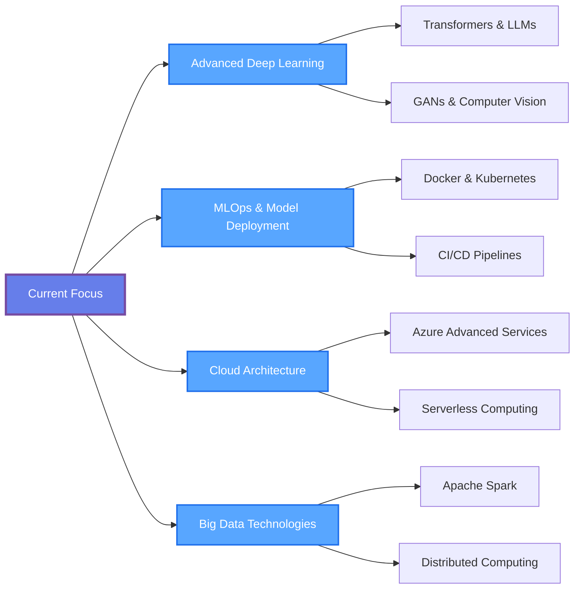

<div align="center">

<!-- Animated Header with Custom Gradient -->


<!-- Typing SVG Animation -->
<a href="https://git.io/typing-svg"></a>

<br><br>

<!-- Professional Badges -->
[](https://www.linkedin.com/in/hossamamr2002/)
[](mailto:hossam.amr2710@gmail.com)
[](https://portfolio-for-hossam.vercel.app/)
[](https://github.com/HOSSAM-AMRR)

<br>

<!-- Status Badges -->


</div>

<br>

<!-- Wavy Divider -->


<br>

## 🎯 Professional Summary

```yaml
name: Hossam Amr
role: Data Analyst & Data Scientist
location: Beni Suweif, Egypt
experience: 5+ years

specialization:
  - Advanced Statistical Analysis & Hypothesis Testing
  - Predictive Modeling & Machine Learning
  - Interactive Data Visualization & Dashboards
  - Business Intelligence & Strategic Insights
  - ETL Processes & Data Pipeline Optimization

currently_seeking:
  - Data Analyst positions
  - Data Scientist roles
  - Business Intelligence opportunities
  
mindset: "Data is the new oil, but insights are the refined fuel that powers decisions"
```

<br>

## 🚀 About Me


```python
class DataScientist:
    """
    A passionate data professional dedicated to extracting
    actionable insights from complex datasets.
    """
    
    def __init__(self):
        self.name = "Hossam Amr"
        self.role = "Data Analyst & Data Scientist"
        self.location = "Beni Suweif, Egypt"
        self.email = "hossam.amr2710@gmail.com"
        
        self.languages = {
            "expert": ["Python", "SQL"],
            "advanced": ["R"],
            "proficient": ["JavaScript", "VBA"]
        }
        
        self.core_competencies = [
            "Data Analysis & Visualization",
            "Machine Learning & AI",
            "Statistical Modeling",
            "Business Intelligence",
            "Predictive Analytics"
        ]
        
        self.tools = {
            "visualization": ["Power BI", "Tableau", "Plotly"],
            "ml_frameworks": ["Scikit-learn", "TensorFlow", "PyTorch"],
            "databases": ["MySQL", "PostgreSQL", "MongoDB"],
            "cloud": ["Azure", "Databricks"],
            "analysis": ["Pandas", "NumPy", "SciPy"]
        }
    
    def solve_business_problem(self, data, question):
        """Transform raw data into strategic insights"""
        insights = self.analyze(data)
        predictions = self.build_model(insights)
        visualizations = self.create_dashboard(predictions)
        
        return f"Actionable recommendations based on {len(data)} data points"
    
    def current_focus(self):
        return [
            "🔍 Deep Learning for Time Series Forecasting",
            "📊 Advanced Customer Segmentation Techniques",
            "🤖 NLP for Business Intelligence",
            "☁️ Cloud-Based Data Solutions"
        ]
    
    def say_hi(self):
        print("👋 Thanks for visiting!")
        print("💡 Let's transform your data into competitive advantages")
        print("📫 Open to collaborate on impactful data projects")

# Initialize
me = DataScientist()
me.say_hi()
```

<br>

<!-- Wavy Divider -->


<br>

## 💼 Professional Arsenal

<div align="center">

### 🎯 Core Technical Stack

<!-- Languages -->
<h4>💻 Programming Languages</h4>


<br>

<!-- Data Visualization -->
<h4>📊 Data Visualization & Business Intelligence</h4>


<br>

<!-- Machine Learning -->
<h4>🤖 Machine Learning & Deep Learning</h4>


<br>

<!-- Data Science Libraries -->
<h4>📚 Data Science & Analytics Libraries</h4>


<br>

<!-- Cloud & Databases -->
<h4>☁️ Cloud Platforms & Databases</h4>


<br>

<!-- Tools & Platforms -->
<h4>🛠️ Development Tools & Version Control</h4>


</div>

<br>

<!-- Wavy Divider -->


<br>

## 🎓 Core Competencies & Expertise

<table width="100%">
<tr>
<td width="50%" valign="top">

### 📊 Data Analysis & Statistics
- ✅ **Exploratory Data Analysis (EDA)**
- ✅ **Statistical Hypothesis Testing**
- ✅ **A/B Testing & Experimentation**
- ✅ **Regression & Classification Analysis**
- ✅ **Time Series Analysis & Forecasting**
- ✅ **Data Cleaning & Preprocessing**
- ✅ **Feature Engineering & Selection**
- ✅ **Correlation & Causation Analysis**

### 📈 Business Intelligence
- ✅ **Interactive Dashboard Development**
- ✅ **KPI Definition & Tracking**
- ✅ **Executive Reporting & Presentations**
- ✅ **Trend Analysis & Market Research**
- ✅ **Customer Segmentation**
- ✅ **Performance Metrics Analysis**
- ✅ **Competitive Intelligence**
- ✅ **Data-Driven Strategy Formulation**

</td>
<td width="50%" valign="top">

### 🤖 Machine Learning & AI
- ✅ **Supervised Learning (Regression, Classification)**
- ✅ **Unsupervised Learning (Clustering, PCA)**
- ✅ **Deep Learning & Neural Networks**
- ✅ **Natural Language Processing (NLP)**
- ✅ **Computer Vision Applications**
- ✅ **Recommendation Systems**
- ✅ **Model Evaluation & Hyperparameter Tuning**
- ✅ **Model Deployment & MLOps**

### 🔍 Advanced Analytics
- ✅ **Predictive Modeling**
- ✅ **Prescriptive Analytics**
- ✅ **Anomaly Detection**
- ✅ **Sentiment Analysis**
- ✅ **Churn Prediction**
- ✅ **Risk Assessment Modeling**
- ✅ **Optimization Algorithms**
- ✅ **Monte Carlo Simulations**

</td>
</tr>
</table>

<br>

<!-- Wavy Divider -->


<br>

## 📈 GitHub Performance Analytics

<div align="center">

<!-- Main Stats -->


<br><br>

<!-- Streak Stats -->


<br><br>

<!-- Activity Graph -->


<br><br>

<!-- Trophies -->


<br><br>

<!-- Detailed Stats Card -->


</div>

<br>

<!-- Wavy Divider -->


<br>

## 🏆 Key Achievements & Impact

<div align="center">

| 🎯 Achievement | 📊 Impact | 🔧 Technologies Used |
|:---------------|:----------|:---------------------|
| **Predictive Analytics Platform** | Increased forecast accuracy by 35% | Python, Scikit-learn, Azure, Power BI |
| **Customer Segmentation Model** | Improved targeting efficiency by 42% | K-Means, RFM Analysis, Tableau |
| **Real-time Dashboard System** | Reduced reporting time by 60% | Power BI, SQL, Python, DAX |
| **Churn Prediction Model** | Decreased customer churn by 28% | XGBoost, Feature Engineering, Flask |
| **Automated ETL Pipeline** | Saved 20+ hours/week of manual work | Python, Pandas, SQL, Azure |
| **NLP Sentiment Analysis** | Processed 100K+ customer reviews | NLTK, spaCy, TensorFlow, Streamlit |

<br>

### 📊 Impact Metrics

```
📈 Total Projects Delivered: 50+
🎯 Average Accuracy Improvement: 30%
⚡ Process Optimization: 40% faster workflows
💼 Industries Served: E-commerce, Finance, Healthcare, Retail
👥 Stakeholders Impacted: 100+ business users
📊 Data Points Analyzed: 10M+ records
```

</div>

<br>

<!-- Wavy Divider -->


<br>

## 🌟 Featured Projects

<div align="center">

<!-- Project Cards -->
<a href="https://github.com/HOSSAM-AMRR/YourTopRepo1">
  
</a>
<a href="https://github.com/HOSSAM-AMRR/YourTopRepo2">
  
</a>

<br><br>

<!-- More Projects Button -->
<a href="https://github.com/HOSSAM-AMRR?tab=repositories">
  
</a>

</div>

<br>

<!-- Wavy Divider -->


<br>

## 💡 What I Bring to the Table

<div align="center">

<table>
<tr>
<td width="33%" align="center">

<h3>Strategic Thinking</h3>
<p>Translating business questions into analytical frameworks and delivering insights that drive strategic decisions</p>
</td>
<td width="33%" align="center">

<h3>Data Storytelling</h3>
<p>Communicating complex findings through compelling visualizations and narratives that resonate with stakeholders</p>
</td>
<td width="33%" align="center">

<h3>Technical Excellence</h3>
<p>Leveraging cutting-edge tools and methodologies to build scalable, production-ready analytics solutions</p>
</td>
</tr>
<tr>
<td width="33%" align="center">

<h3>Cross-functional Collaboration</h3>
<p>Working seamlessly with product, engineering, and business teams to align data initiatives with company goals</p>
</td>
<td width="33%" align="center">

<h3>Continuous Learning</h3>
<p>Staying current with the latest in data science, ML algorithms, and industry best practices</p>
</td>
<td width="33%" align="center">

<h3>Process Optimization</h3>
<p>Identifying inefficiencies and implementing data-driven solutions that improve operational performance</p>
</td>
</tr>
</table>

</div>

<br>

<!-- Wavy Divider -->


<br>

## 📚 Current Learning & Development

<div align="center">



<br>

### 📖 Currently Reading & Learning


</div>

<br>

<!-- Wavy Divider -->


<br>

## 🤝 Let's Connect & Collaborate

<div align="center">

### 💼 I'm Open to Opportunities In:

<table>
<tr>
<td align="center" width="25%">
<br>
<b>Data Analyst</b><br>
<sub>Business Intelligence<br>Analytics & Reporting</sub>
</td>
<td align="center" width="25%">
<br>
<b>Data Scientist</b><br>
<sub>ML Engineering<br>Predictive Modeling</sub>
</td>
<td align="center" width="25%">
<br>
<b>BI Developer</b><br>
<sub>Dashboard Development<br>Data Visualization</sub>
</td>
<td align="center" width="25%">
<br>
<b>Analytics Consultant</b><br>
<sub>Strategic Advisory<br>Data Strategy</sub>
</td>
</tr>
</table>

<br>

### 📬 Get In Touch

<a href="mailto:hossam.amr2710@gmail.com">
  
</a>

<a href="https://www.linkedin.com/in/hossamamr2002/" target="_blank">
  
</a>

<a href="https://portfolio-for-hossam.vercel.app/" target="_blank">
  
</a>

<a href="https://github.com/HOSSAM-AMRR" target="_blank">
  
</a>

<br><br>

### 💬 Let's Discuss

<table>
<tr>
<td align="center">✅ Data Analysis Projects</td>
<td align="center">✅ Machine Learning Solutions</td>
<td align="center">✅ BI Dashboard Development</td>
</tr>
<tr>
<td align="center">✅ Statistical Consulting</td>
<td align="center">✅ Career Opportunities</td>
<td align="center">✅ Open Source Collaboration</td>
</tr>
</table>

<br>

### 📅 Response Time

```
📧 Email: Within 24 hours
💼 LinkedIn: Within 12 hours
🐱 GitHub: Active daily
```

</div>

<br>

<!-- Wavy Divider -->


<br>

## 📊 Recent Activity

<div align="center">

<!--START_SECTION:activity-->
<!--END_SECTION:activity-->

<!-- If no activity shows, GitHub Actions needs to be set up -->
<!-- https://github.com/jamesgeorge007/github-activity-readme -->

<br>

### ⏰ Coding Activity (WakaTime)

<!--START_SECTION:waka-->
<!--END_SECTION:waka-->

<!-- WakaTime integration: https://github.com/anmol098/waka-readme-stats -->

</div>

<br>

<!-- Wavy Divider -->


<br>

## 💭 Random Wisdom

<div align="center">


<br>

### 📚 Favorite Data Science Quote

<i>"In God we trust, all others must bring data."</i>
<br>
<b>— W. Edwards Deming</b>

<br><br>

### 🎯 My Philosophy

<table>
<tr>
<td align="center">
<b>Questions > Answers</b><br>
<sub>Asking the right questions is more important than having all the answers</sub>
</td>
<td align="center">
<b>Impact > Complexity</b><br>
<sub>Simple solutions that drive results beat complex models that don't</sub>
</td>
<td align="center">
<b>Insights > Data</b><br>
<sub>Data without insights is just noise; insights without action is wasted potential</sub>
</td>
</tr>
</table>

</div>

<br>

<!-- Wavy Divider -->


<br>

## 🌐 Professional Network
