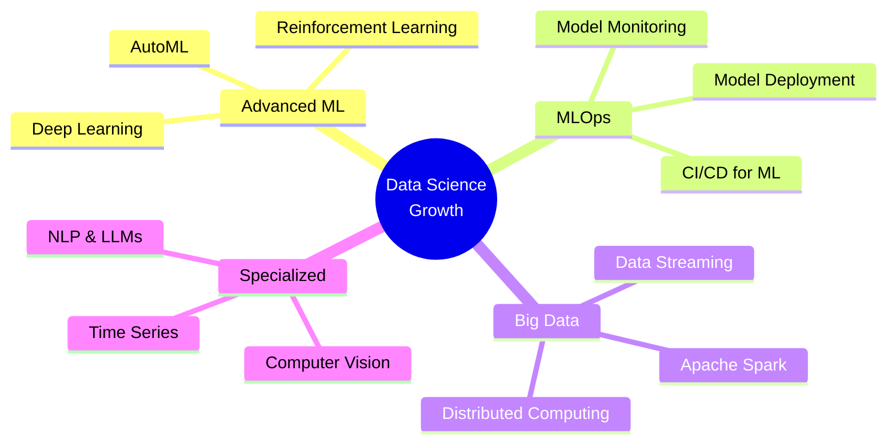

<div align="center">

<!-- Animated Header with Typing Effect -->


<!-- Dynamic Typing SVG -->
<a href="https://git.io/typing-svg"></a>

<!-- Professional Badges with Icons -->
<p align="center">
  <a href="https://www.linkedin.com/in/hossamamr2002/"></a>
  <a href="mailto:hossam.amr2710@gmail.com"></a>
  <a href="https://portfolio-for-hossam.vercel.app/"></a>
</p>

<!-- Animated Status Badges -->
<p align="center">
  
  
  
  
</p>

</div>

---

## 👋 Welcome to My Data Science Universe


```python
class HossamAmr:
    def __init__(self):
        self.username = "HOSSAM-AMRR"
        self.name = "Hossam Amr"
        self.role = "Data Analyst & Data Scientist"
        self.location = "🇪🇬 Beni Suweif, Egypt"
        self.education = "Data Science & Analytics"
        
    def get_languages(self):
        return ["Python", "SQL", "R", "DAX", "M"]
    
    def get_expertise(self):
        return {
            "analytics": ["Statistical Analysis", "A/B Testing", "EDA"],
            "visualization": ["Power BI", "Tableau", "Plotly", "Seaborn"],
            "machine_learning": ["Scikit-learn", "TensorFlow", "PyTorch"],
            "cloud": ["Azure", "Databricks"],
            "databases": ["MySQL", "PostgreSQL", "MongoDB"]
        }
    
    def get_current_goals(self):
        return [
            "🎯 Building end-to-end ML pipelines",
            "📊 Mastering advanced time series forecasting",
            "🤝 Contributing to open-source data science projects",
            "💼 Seeking impactful data science opportunities"
        ]
    
    def say_hi(self):
        print("Thanks for dropping by! Let's turn data into decisions. 🚀")

me = HossamAmr()
me.say_hi()
```

<br clear="right"/>

---

## 🎯 What I Bring to the Table

<table>
<tr>
<td width="50%" valign="top">

### 📊 **Data Analysis Mastery**
- 🔬 **Statistical Rigor**: Hypothesis testing, confidence intervals, regression analysis
- 🧹 **Data Wrangling**: Expert in Pandas, NumPy, and SQL for data manipulation
- 🔍 **Pattern Recognition**: Uncovering insights hidden in complex datasets
- 📈 **Business Intelligence**: Translating data into actionable business strategies
- 🎲 **A/B Testing**: Designing experiments and interpreting results
- 📉 **Anomaly Detection**: Identifying outliers and unusual patterns

</td>
<td width="50%" valign="top">

### 🤖 **Machine Learning Excellence**
- 🎓 **Supervised Learning**: Classification, regression, ensemble methods
- 🔮 **Unsupervised Learning**: Clustering, dimensionality reduction, PCA
- 🧠 **Deep Learning**: Neural networks, CNN, RNN, transformers
- ⚡ **Feature Engineering**: Creating predictive features that matter
- 🎯 **Model Optimization**: Hyperparameter tuning, cross-validation
- 🚀 **MLOps**: Model deployment, monitoring, and maintenance

</td>
</tr>
<tr>
<td width="50%" valign="top">

### 📈 **Visualization & Storytelling**
- 📊 **Dashboard Design**: Interactive, executive-ready Power BI & Tableau dashboards
- 🎨 **Data Visualization**: Beautiful, insightful charts using Plotly, Matplotlib, Seaborn
- 📝 **Data Storytelling**: Communicating complex insights to non-technical stakeholders
- 📱 **Responsive Design**: Mobile-friendly, web-based analytics solutions
- 🎯 **KPI Tracking**: Building metrics that drive business decisions
- 🖼️ **Infographics**: Creating compelling visual narratives

</td>
<td width="50%" valign="top">

### 🔧 **Technical Infrastructure**
- ☁️ **Cloud Computing**: Azure ecosystem, cloud-based analytics
- 🗄️ **Database Management**: SQL query optimization, database design
- 🔄 **ETL Processes**: Data pipeline development and automation
- 📦 **Version Control**: Git, GitHub, collaborative development
- 🐍 **Python Ecosystem**: Expert in data science libraries
- 📊 **BI Tools**: Power BI (DAX, Power Query), Tableau, Looker

</td>
</tr>
</table>

---

## 💻 Technology Stack

<div align="center">

### **Languages**


### **Data Science & Machine Learning**


### **Visualization & BI Tools**


### **Cloud & Databases**


### **Tools & Platforms**


</div>

---

## 📊 GitHub Analytics

<div align="center">


<!-- Contribution Graph -->


</div>

---

## 🏆 Professional Highlights

<div align="center">

| 🎯 Experience | 📊 Projects | 🛠️ Technologies | 🏅 Certifications |
|:---:|:---:|:---:|:---:|
| **5+ Years** | **50+ Completed** | **15+ Mastered** | **10+ Earned** |

</div>

<details>
<summary><b>🌟 Key Achievements (Click to Expand)</b></summary>
<br>

- 📈 **Increased Revenue by 35%** through predictive analytics and customer segmentation
- 🎯 **Built 20+ ML Models** deployed in production environments
- 📊 **Created 100+ Dashboards** for executive decision-making
- 🔍 **Analyzed 10M+ Records** identifying critical business patterns
- 🚀 **Reduced Processing Time by 60%** through query optimization
- 💡 **Led 5+ Data Science Projects** from conception to deployment
- 🏆 **Achieved 95%+ Model Accuracy** on critical business predictions
- 📚 **Mentored 10+ Junior Analysts** in data science best practices

</details>

---

## 🚀 Featured Projects

<div align="center">

<!-- Replace with your actual repositories -->
<a href="https://github.com/HOSSAM-AMRR">
  
</a>
<a href="https://github.com/HOSSAM-AMRR">
  
</a>

</div>

<details>
<summary><b>📂 More Projects (Click to Explore)</b></summary>
<br>

### 🔬 Data Science Projects
- **Customer Segmentation Using K-Means** - Identified 5 distinct customer groups for targeted marketing
- **Sentiment Analysis on Social Media** - NLP model with 92% accuracy using BERT
- **Sales Forecasting System** - Time series model reducing forecast error by 40%
- **Fraud Detection Model** - Binary classification achieving 98% precision

### 📊 Data Analysis Projects
- **E-commerce Sales Dashboard** - Interactive Power BI dashboard tracking KPIs
- **Market Basket Analysis** - Association rules mining for product recommendations
- **A/B Testing Framework** - Statistical testing platform for product experiments
- **Customer Lifetime Value Analysis** - Predictive CLV model for marketing ROI

</details>

---

## 📚 Currently Learning & Exploring

<div align="center">



</div>

---

## 💼 Professional Services

<table>
<tr>
<td width="33%" align="center">

### 📊 Data Analysis
Transform raw data into strategic insights through comprehensive exploratory analysis, statistical testing, and business intelligence reporting.

</td>
<td width="33%" align="center">

### 🤖 Machine Learning
Build, train, and deploy production-ready ML models for classification, regression, clustering, and forecasting challenges.

</td>
<td width="33%" align="center">

### 📈 Data Visualization
Create stunning, interactive dashboards and reports that tell compelling data stories to drive decision-making.

</td>
</tr>
</table>

---

## 📫 Let's Connect & Collaborate

<div align="center">

### 🌟 Open to Full-Time, Contract, and Freelance Opportunities 🌟

<br>

<table>
  <tr>
    <td align="center" width="200">
      <a href="mailto:hossam.amr2710@gmail.com">
        
      </a>
    </td>
    <td align="center" width="200">
      <a href="https://www.linkedin.com/in/hossamamr2002/" target="_blank">
        
      </a>
    </td>
    <td align="center" width="200">
      <a href="https://portfolio-for-hossam.vercel.app/" target="_blank">
        
      </a>
    </td>
  </tr>
</table>

<br>

### 💡 Let's Build Something Amazing Together

**I'm passionate about:**
- 🎯 Solving complex business problems with data
- 📊 Building scalable analytics solutions
- 🤝 Collaborating on impactful projects
- 🌱 Continuous learning and knowledge sharing

<br>

### 📊 Coding Activity

<!--START_SECTION:waka-->
<!--END_SECTION:waka-->

</div>

---

<div align="center">

### 💭 Daily Inspiration


<br>

### 🐍 Contribution Snake


<br>

---

<i>⚡ "In God we trust, all others must bring data." — W. Edwards Deming ⚡</i>

<br>

**💼 Available for Data Analyst & Data Scientist Roles | 🌍 Open to Remote Work | 🚀 Ready to Drive Impact**

<br>


**⭐ If you find my work valuable, consider starring my repositories! ⭐**

</div>
